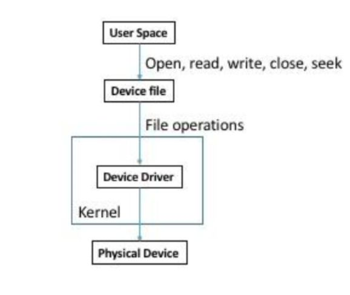

## PA3 - Device Driver
### introduction
this assignment will explore file i/o in the kernel and how to implement a basic device driver
using a loadable kernel module (lkm)

### devices in linux
device i/o is modeled using files. reading from and writing to a file will invoke the associated
device driver to do the actual reading and writing. all device drivers have a major and minor
number where the major number is unique to every driver, and the minor number differentiates all
the devices belonging to that driver. eg, a typical system will have multiple hard disks, or at
least partitions on a single disk. a single major number number is used to specify the hard disk
device driver, but each partition has a different minor number.
```shell
$ file /dev/sda*
/dev/sda:  block special (8/0)
/dev/sda1: block special (8/1)
/dev/sda2: block special (8/2)
/dev/sda3: block special (8/3)
```

there are two kinds of device drivers:
* **character driver** reads and writes to/from the device character by character. this is the
most basic type of device driver and is simplest to implement
* **block device driver** reads and writes chunks (blocks) of data with a single read/write
operation. these types of drivers are more complex, but usually more efficient in use of system
resources. network interfaces and disk controller generally prefer to use a block driver.

### creating device file
to access device driver, a correspondingfile in the `/dev` directory is needed. create it with
`mknod -m <permission> <path> <type> <major> <minor>`, for example
`mknod -m 777 /dev/simple_char_device c 511 0` creates a file where the permission is set so all
users can read, write, and execute the file, `c` specifies the type of driver as a character
driver, 511 is the major number, and 0 is the minor number.

### driver overview
a userspace program will be used to issue calles `open()`, `read()`, `write()`, `seek()`, or 
`close()`. these calls will access the file created in `/dev`, which is associated with driver.
for example. the driver by way of its major and minor numbers indicates to the kernel that you
are trying to perform file operations on a device. the kernel will invoke corresponding file
operations in on driver file. driver then executes it's implementation of these file operations
against the physical device. (our device driver will only read and write to memory regions)


### implementation
along with header files necessary for module programming, `linux/fs.h` and `linux/uaccess.h` files
will also need to be included. delcare `init()` and `exit()` functions with `module_init()` and
`module_exit()` to bind these functions. in your init function, register your character driver
using `register_chrdev()`. in exit function, unregister the driver using `unregister_chrdev()`.
`register_chrdev()` takes three parameters; major number, unique name, and pointer to file
operations struct. we'll use dynamically allocated kernel buffer (`device_buffer`) with a fixed
size of 900 bytes to store the data written to device. there are two core functions to manage
memory in the kernel defined in `linux/slab.h`: `void* kmalloc(size, flags)` and
`void kfree(kptr)`. use `GFP_KERNEL` as the flags argument above.

### operations
to perform operations on device driver, a `file_operations` struct is needed. system defined struct
is found in `/lib/modules/.../build/include/linux/fs.h`. create a similar structure with the same
`struct file_operations` type, but different name. define only the open, close, seek, read, and
write operations. **these are the five functions you need to implement**, and set the function
pointer in `file_operations` struct to point to your implementations. note, there is no close
function here. use `release()` instead. specifications are found below

**open** -- function takes two parameters; a pointer to an inode struct which represents the
physical file on the disk, and a pointer to a file struct which represents the state of a file,
and returns an integer indicating success or failure. this function does not need to do anything
other than log the number of times the device has been opened

**release** -- function takes the same two arguments as `open()` an**release** - function takes the same two arguments as `open()` and again returns an integer indicating success or failure. use
`printk()` to output the number of times the device has been closed

**read** - function expects four parameters: a file pointer, a pointer to a userspace buffer, the
size of that buffer, and a pointer to the current position. use the function `copy_to_user()` to
copy data from the `device_buffer` starting at the current position to the userspace buffer. if
successful, update the current position and return the number of bytes read and print the value

**write** -- function is similar to read. copy data stored in the userspace buffer into the
`device_buffer` using `copy_from_user()`. the write starts from the current position and if
successful, the position should be updated. print the number of bytes written. finally, return
the number of bytes written to the caller. if the user sets the current position back to the
beginning of the file (using seek), this operation may overwrite existing data

**seek** -- function takes three parameters: a file pointer, an offset, and the whence value.
whence describes how to interpret the offset (which can be negative). if the value of whence is
0 (`SEEK_SET`), the position is set to the value of the offset. if the value of whence is 1
(`SEEK_CUR`), the current position is incremented (or decremented if negative offset) by offset
bytes. lastly if the value of whence is 2 (`SEEK_END`), the position is set to the offset bytes
from the end of the file

if a user attempts to seek before the beginning or beyond the end of the `device_buffer`, the seek
should set the current position to the  beginning or end of the file respectively. in other words,
a seek should never fail. if a user attempts to read or write where the number of bytes would pass
the end of the `device_buffer`, driver should only read or write until the end of the buffer and
then return the number of bytes actually read or written.

### install & test module
verify it is installed by checking kernel log for `printk()` outputs, the `lsmod` command, or by
looking in `/proc/devices`. try to write into and read from device using commands like echo, cat,
head, tail, etc.
