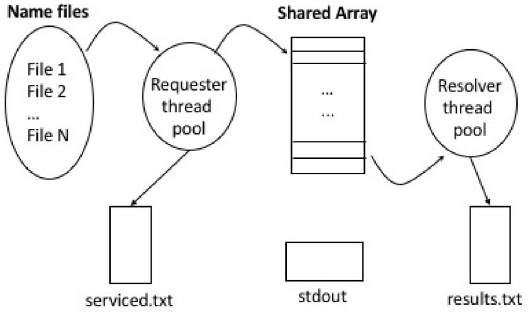

## PA6 - Threaded Resolver
### overview
this assignment will develop a multi-threaded application that resolves domain names
to ip addresses. this is similar to the operation performed each time you access a new
website in your web browser. the application will utilise two types of worker threads:
**requesters** and **resolvers**. these threads will communicate with eachother using a
shared  array, sometimes referred to as a bounded buffer. the diagram below outlines
the desired configuration

provided is a set of input files that containe one hostname per line. your program
will process each of these files using a single requester thread per file, where each
thread will read the file line by line, place the hostname into the shared array, and
write this hostname into the requester logfile. you will also create some number of
resolver threads, again determined by a command line argument, that will remove
hostnames from the shared array, lookup the ip address for that hostname, and write
the results to the resolver logfile. once all the input files have been parsed, the
requester threads will terminate. once all the hostnames have been looked up, the
resolver threads will terminate and the program will end.

### mutli-lookup man page
```
NAME
multi-lookup - resolve a set of hostnames to IP addresses

SYNOPSIS
multi-lookup <# requester> <# resolver> <requester log> <resolver log> [ <data file> ... ]

DESCRIPTION
The file names specified by <data file> are passed to the pool of requester threads which place
information into a shared data area. Resolver threads read the shared data area and find the
corresponding IP address.

<# requesters> number of requestor threads to place into the thread pool
<# resolvers> number of resolver threads to place into the thread pool
<requester log> name of the file into which requested hostnames are written
<resolver log> name of the file into which hostnames and resolved IP addresses are written
<data file> filename to be processed. Each file contains a list of host names, one per line, that
are to be resolved

SAMPLE INVOCATION
./multi-lookup 5 5 serviced.txt resolved.txt input/names*.txt

SAMPLE CONSOLE OUTPUT
thread d2fa8700 serviced 6 files in 0.200960 seconds
thread d37a9700 serviced 6 files in 0.201183 seconds
thread d27a7700 serviced 6 files in 0.201345 seconds
thread d3faa700 serviced 6 files in 0.201562 seconds
thread d47ab700 serviced 6 files in 0.201787 seconds
thread d4fac700 resolved 177 hosts in 0.202039 seconds
thread d57ad700 resolved 89 hosts in 0.202088 seconds
thread d67af700 resolved 171 hosts in 0.202204 seconds
thread d6fb0700 resolved 32 hosts in 0.202244 seconds
thread d5fae700 resolved 137 hosts in 0.202215 seconds
./multi-lookup: total time is 0.202741 seconds
```

### requester threads
your application will take an argument for the number of requester threads. this pool
of threads service a set of text files as input, each of which contains a list of
hostnames. each name read should be placed on the shared array. if a requester thread
tries to write to the array but finds that it is full, it should block until a space
opens up in the array. after servicing an input file, a requester thread checks if
there are any remaining input files left to service. if so, it requests one of the
remaining files next. this process goes on until all input files have been processed.
if there are no more input files remaining, the thread writes the number of files it
serviced to stdout in the following format:
```
thread <thread_id> serviced ### files
```
to get the id of a thread on linux systems, use `gettid()`, or more preferably,
`pthread_self()` for a posix compliant implementation.

### resolver threads
the second thread pool is comprised of a set of resolver threads. a resolver thread
consumers the shared array by taking a name off the array and resolving its ip
address. after the name has been mapped to an ip address, the output is written to a
line in the resolver logfile in the following format:
```
google.com, 74.125.224.81
```
if the resolver is unable to find the ip address for a hostname, it should leave
`NOT_RESOLVED` instead of an ip address. if a resolver tries to read from the array
but find that it is empty, it should block until there is a new item in the array or
all names in the input files have been serviced. if there are no more hostnames
remaining, the thread writes the number of names it successfully resolved to stdout
in the following format:
```
thread <thread_id> resolved ### hostnames
```

### shared array
thre thread safe shared array will require you to implement a solution to the bounded
buffer problem as discussed in lecture and textbook. the shared array must be built
on top of a single, contiguous, linear array of memory. you can organise this array
as a queue (fifo), circular queue, or stack (lifo). solutions that rely on linked
lists, trees, dictionaries, etc. will not be accepted.

### synchronisation, deadlock, & starvation
application should synchronise access to shared resources and avoid any deadlock or
busying wait. you should use some combination of mutexes, semaphores, and/or
condition variables to meet this requirement. there are several shared resources that
must be protected: the shared array, the logfiles, stdout/stderr, and argc/argv. none
of these resources are thread safe by default. we will be measuring the runtime of
your solution to determine if it is experiencing any sort of starvation. if you
misuse a synchronisation mechanism and essentially create a serialised solution (
where your threads run in sequence, rather than in parallel), your grade will be
reduced.

### ending program
your program must end after all the names in each input file have been serviced by
the application. this means that all the hostnames in all the input files have
received a corresponding line in the output file. just prior to exiting, your
program will print the total runtime to stdout:
```
./multi-lookup: total time is 2.420237 seconds
```

### limits
several macros should be defined to impose the following limits on your program. if
the user specifies input that violate an imposed limit, your program should alert
the user gracefully to the limit and exit with an error and appropriate return
value. you should define these macros in corresponding header files:
* `ARRAY_SIZE`: 8 - number of elements in the shared array used by the requester
and resolved threads to communicate
* `MAX_INPUT_FILES`: 100 - maximum number of hostname file arguments allowed
* `MAX_REQUESTER_THREADS`: 10 - maximum number of concurrent requester threads
allowed
* `MAX_RESOLVER_THREADS`: 10 - maximum number of concurrent resolver threads allowed
* `MAX_IP_LENGTH`: `INET6_ADDRSTRLEN` - maximum size ip address string `util.c` will
return

### error handling
program must accept arguments as detailed in the above manual page. progam should
deal with the following conditions:
* missing arguments - terminate with a usage synopsis to stdout
* arguments that are out of range (too many input files) - terminate with an error
message to stderr
* if a log file exists and is writeable, it should overwritten
* if a log file does not exist, it should be created by program
* missing or unreadable input files - print `invalid file <filename>` to stderr,
then move onto next file

### valgrind
to verify there are no memory leaks, valgrind will be used to test program. usage:
```
valgrind ./multi-lookup 5 5 serviced.txt results.txt input/names1*.txt
```
valgrind should report that you have freed all allocated memory and should produce
any additional warnings or errors:
```
==21728== Memcheck, a memory error detector
==21728== Copyright (C) 2002-2015, and GNU GPL'd, by Julian Seward et al.
==21728== Using Valgrind-3.11.0 and LibVEX; rerun with -h for copyright info
==21728== Command: ./multi-lookup 5 5 serviced.txt results.txt input/names11.txt input/names12.txt input/names13.txt input/names14.txt input/names15.txt input/names1.txt
==21728==
./multi-lookup: total time is 2.420237 seconds
==21728==
==21728== HEAP SUMMARY:
==21728==     in use at exit: 0 bytes in 0 blocks
==21728==   total heap usage: 1,723 allocs, 1,723 frees, 9,394,035 bytes allocated
==21728==
==21728== All heap blocks were freed -- no leaks are possible
==21728==
==21728== For counts of detected and suppressed errors, rerun with: -v
==21728== ERROR SUMMARY: 0 errors from 0 contexts (suppressed: 0 from 0)
```
for comparison, here's output from a leaky program:
```
==22400== HEAP SUMMARY:
==22400==     in use at exit: 7,380 bytes in 618 blocks
==22400==   total heap usage: 8,115 allocs, 7,497 frees, 45,674,418 bytes allocated
==22400==
==22400== LEAK SUMMARY:
==22400==    definitely lost: 7,380 bytes in 618 blocks
==22400==    indirectly lost: 0 bytes in 0 blocks
==22400==      possibly lost: 0 bytes in 0 blocks
==22400==    still reachable: 0 bytes in 0 blocks
==22400==         suppressed: 0 bytes in 0 blocks
==22400== Rerun with --leak-check=full to see details of leaked memory
```
