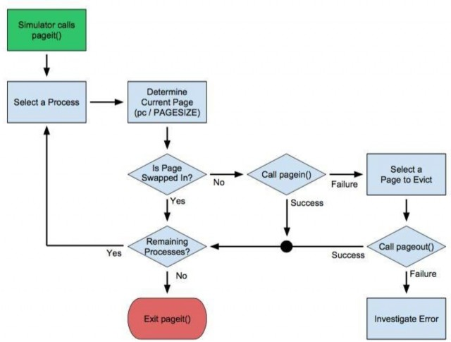

## PA7 - LRU
### introduction
modern operating systems use virtual memory and paging in order to
effectively utilise the computer's memory hierarchy. paging provides
memory space protection to processes, enables the use of secondary
storage, and also removes the need to allocate memory sequentially for
each process. we have studied how virtual memory systems are structured
and how the mmu converts virtual memory addresses to physical memory
addresses by means of a page table and a tlb. when a page has a valid
mapping from a virtual memory address to a physical address, we say the
page is swapped in. when no valid mapping is available, the page is
either invalid (segmentation fault) or more likely, swapped out. when
the mmu determines that a memory request requires access to a page that
is currently swapped out, it calls the operating system's page fault
handler. this handler must swap in the necessary page, possibly
evicting another page to secondary memory in the process. it then
retries the offending memory access and hands control back to the mmu.
as you may imaging, how the os chooses which page to evict when it has
reached the limit of available physical pages (frames) can have a
major effect on the performance of memory access on a given system. in
this assignment, we will look at the various strategies for managing
the system page table and controlling when pages are paged and out.

### assignment
the goal of this assignment is to implement a paging strategy that
maximises the performance of the memory access in a set of predefined
programs. you will accomplish this by using a paging simulator that
has been created for you. your job is to write the paging strategy that
the simulator utilises. your initial goal will be to create a least
recently used (lru) paging implementation. you will then implement a
predictive paging algorithm for pa8, with the intent of increasing the
performance of your paging policy. you will be graded on the throughput
of your solution (the ratio of time spent doing useful work vs. time
spent waiting on necessary paging to occur).

### paging simulator environment
the paging simulator has been provided. you have access to the source
code if you wish to review it (`simulator.{c,h}`), but you should not
need to modify the code. you will be graded using the unmodified
simulator, so any enhancements to the simulator program made with the
intention of improving your performance will be for naught. the
simulator runs a random set of programs utilising a limited number of
shared physical pages. each process has a fixed number of virtual
pages (that compose the process's virtual memory space) that it might
try to access. for the purpose of this simulation, all memory access is
due to the need to load program code. the simulated program counter for
each process dictates which memory location that process currently
requires access to, and thus which virtual page must be swapped in for
the process to successfully continue. the values of contants mentioned
above are available in the `simulator.h` file. for the purpose of
grading, the default values will be used:

* 20 virtual pages per process (`MAXPROCPAGES`)
* 20 simultaneous processes competing for pages (`MAXPROCESSES`)
* 128 memory unit page size (`PAGESIZE`)
* 100 tick delay to sway a page in or out (`PAGEWAIT`)
* 100 physical pages (frames) total (`PHYSICALPAGES`)
* 40 processes run in total (`QUEUESIZE`)

as you can see, you are working in a very resource constrained
environment. you will have to deal with attempts to access up to 400
virtual pages (20 processes times 20 virtual pages per process), but
may only have at most 100 physical pages swapped in at any given time.
in addition, swapping a page in or out is an expensive operation,
requiring 100 ticks to complete. a tick is the minimum time unit used
in the simulator. each instruction or step in the simulated programs
requires one tick to complete. thus, in the worst case where every
instruction is a page miss (requiring a swap in), you will spend 100
ticks of paging overhead for every 1 tick of useful work. if all
physical pages are in use, this turns into 200 ticks per page miss
since you must also spend 100 ticks swapping a page out in order to
make room for the required page to be swapped in. this leads to an
overhead to useful work ratio 200:1, which is very poor performance.
your goal is to implement a system that does much better than this.

### simulator interface
the simulator exports three functions which you will use to interact with it: `pageit()`, `pagein()`, and `pageout()`. the first function
`pageit()`, is the core paging function. it is roughly equivalent to
the page fault handler in your operating system. the simulator calls
`pageit()` anytime something interesting happens (memory access, page
fault, process completion, etc.) or basically every cpu cycle, which
we'll refer to as a tick. it passes the function a page map for each
process, as well as the current value of the program counter for each
process. see `simulator.h` for details. you will implement your paging
strategy in the body of this function. the `pageit()` function is
passed an array of pentry structs, one per process. this struct
contains a copy of all the necessary memory information that the
simulator maintains for each process. you will most likely need the
information contained in this struct to make intelligent paging
decisions. you can read these fields as necessary, but should not write
to them, as any changes you make will be lost when you return from
`pageit()`

| variable | behaviour |
|---|---|
| `long active` | flag indicating whether or not the process has been completed. 1 running, 0 exited. |
| `long pc` | value of program counter for the process. the current page can be calculated as `page = pc / PAGESIZE` |
| `long npages` | number of pages in the processes memory space. if the process is active, this will be equal to `MAXPROCPAGES`, otherwise 0 |
| `long pages[MAXPROCPAGES]` | array representing the page map for a given process. if `pages[i]` is 0, page `i` is swapped out, swapping, or swapping in. if `pages[i]` is 1, page `i` is current swapped in |

the simulator also exports the functions `pagein()` and `pageout()`,
which are used to request that a specific page for a specific process
be paged in or out. you will use these functions to control the
allocation of virtual and physical pages when writing your paging
strategy. note that a page will be marked as swapped out as soon as
the `pageout()` request is made, but is not recognised as swapped in
until after the `pagein()` request completes 100 ticks later. `pagein()`
and `pageout()` will return a 1 if they succeed in starting a paging
operation, if the requested paging operation is already in progress,
or if the requested state already exists 100 ticks after requesting
a paging operation, the operation will complete. these functions
return 0 if the paging request can not be processed (due to exceeding
the limit of physical pages or because another paging operation is
currently in process on the requested page) or if the request is
invalid (paging operation requests non-existent page, etc.). see
figure 1 below for more details on function behaviour

the above shows the possible states that a virtual page can occupy, as
well as the possible transitions between these states. note that the
page map values alone do not define all possible page states. we must
also account for the possible operations currently underway on a page
to fully define its state. while the page map for each process can be
obtained from the `pageit()` input array of structs, there is no
interface to directly reveal any operations underway on a given page.
if knowing whether or not a paging operation is underway on a given
page is necessary for your `pageit()` implementation, you must
maintain the data yourself.

### simulated programs
the simulator populates its 20 concurrent processes by randomly
creating them from a collection of 5 types of simulated programs.
pseudo code for each of the possible 5 programs is given below.

#### program 1 - loop with inner branch
```
for 10 30
  run 500
  if .4
    run 900
  else
    run 131
  endif
end
exit
```

#### program 2 - single loop
```
for 20 50
  run 1129
end
exit
```

#### program 3 - double nested loop
```
for 10 20
  run 1166
  for 10 20
    run 516
  end
end
exit
```

#### program 4 - linear
```
run 1911
exit
```

#### program 5 - probabilistic backward branch
```
for 10 20
  label:
    run 500
    if .5
      goto label
   endif
end
exit
```
note that while you know the structure of these programs, any program
flow is still probabilistic in nature. which branch a specific process
takes, how many loop iterations occur, or how long sequential runs are
will be dependent upon the random seed generated by the simulator.
thus, you may never be able to perfectly predict the execution of a
process, only the probabilistic likelihood of a collection of possible
execution paths.

### implementation ideas
in general, your `pageit()` implementation will need to follow the
basic flow presented in figure 2 below. you will probably spend most
of your time deciding how to implement the "select a page to evict"
element.

a basic "one process at a time" implementation is provided for you.
this implementation never actually ends up having to swap out any
pages. since only one process is allocated at a time, no more than 20
pages are ever in use. when each process completes, it releases all of
its pages and the next process is allowed to allocate pages and run.
this is a very simple solution, and you might expect it does not
provide very good performance. still, it provides a demonstration of
the simulator api in use. see `pager-basic.c` for more information.

to start, create some form of least recently used algorithm. an lru
algorithm selects a page that has not been accessed for some time when
it must swap a page out to make room for a new page to be swapped in.
an lru algorithm can either operate globally across all processes, or
locally to a given process and ony allow each process to compete for
pages from this subset. a stub for implementing an lru version of
`pageit()` has been created for you in the `pager-lru.c` file. note
that use of static variables in order to preserve local state between
calls to `pageit()`. your lru algorithm should perform much better
than the trivial solution provided by the `pager-basic.c` algorithm.
